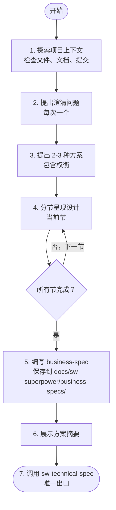

# Brainstorming - 头脑风暴与需求分析

将想法通过苏格拉底式对话转化为清晰的需求和方案决策。

## 何时跳过此技能

**简单任务不经过 brainstorming，直接调用 `sw-test-driven-dev`：**

- 改动范围明显小（Agent 通过快速代码扫描即可确认，如单函数修改、参数调整、局部逻辑修复）
- 纯 Bug 修复（问题明确、修复方案清晰、且**不涉及**新增组件/接口变更/多模块影响）
- 配置/文档/注释修改
- 用户明确说"直接改"或"别走流程"
- 拼写、格式、命名等表面层修复
- 已有明确 Spec 或计划的任务执行

**不确定是否简单？** 走 brainstorming。宁可过度流程，不可跳过设计。

**以下情况必须走 brainstorming，不可走快速通道：**

| 场景 | 说明 |
|------|------|
| Bug 涉及新增组件 | 新增文件、模块、服务 |
| Bug 涉及接口变更 | 修改函数签名、API 契约、数据结构 |
| Bug 影响多个模块 | 修复一处导致其他模块需要适配 |
| 快速扫描后发现改动范围超预期 | 原本以为单函数，实际涉及多处修改 |

**回退规则**：快速扫描后发现改动超出预期 → 立即回退到 brainstorming。

## 核心原则

**铁律：在呈现完整设计之前，严禁：**
- 调用任何实现 Skill（如 sw-subagent-development）
- 编写任何代码
- 创建项目脚手架
- 执行任何实现动作

> 设计必须完整呈现（需求澄清 + 方案决策 + business-spec），但无需在每个节点等待用户明确批准。Agent 自动推进，用户可随时打断。

> **反模式警示**："这个太简单了，不需要设计"
>
> 复杂项目必须经过此流程。"简单"项目是未经验证的假设造成最大浪费的地方。如果改动明显简单（见上方"何时跳过此技能"），直接走 TDD。

## 检查清单

必须按顺序完成以下任务：

- [ ] **探索项目上下文** — 检查文件、文档、最近提交
- [ ] **提出澄清问题** — 每次一个问题，理解目的/约束/成功标准
- [ ] **提出 2-3 种方案** — 包含权衡和你的推荐
- [ ] **分节呈现设计** — 按复杂度调整每节长度，自动推进
- [ ] **编写 business-spec 文档** — 保存到 `docs/sw-superpower/business-specs/YYYY-MM-DD--<name>.md`
- [ ] **展示方案摘要** — 向用户展示决策要点，自动进入下一步
- [ ] **自动调用 sw-technical-spec** — 编写技术 Spec

## 流程图



## 详细流程

### 1. 探索项目上下文

开始提问前，先了解：
- 当前项目结构（`ls -la`, `tree`）
- 相关文档（README, AGENTS.md, 现有 Spec）
- 最近的 Git 提交历史
- 相关的现有代码

**范围评估**：如果请求描述多个独立子系统（如"构建包含聊天、文件存储、计费和分析的平台"），立即标记。不要花时间细化一个需要分解的项目的细节。

如果项目太大：
1. 帮助用户分解为子项目
2. 确定独立组件、依赖关系、构建顺序
3. 对第一个子项目执行正常的头脑风暴流程
4. 每个子项目有自己的 business-spec → technical-spec → plan → 实现周期

### 2. 提出澄清问题

**规则**：
- 每次只能问一个问题
- 尽可能使用选择题，但开放式问题也可以
- 需要更多探索时，将主题分解为多个问题
- 关注：目的、约束、成功标准

**示例对话**：
```
你：这个功能的用户是谁？
用户：主要是我们的内部运营团队。

你：明白了。关于数据存储，你有偏好吗？
A) 继续使用现有的 PostgreSQL
B) 尝试新的 MongoDB
C) 外部服务（如 Firebase）

用户：选 A，保持 PostgreSQL。
```

### 3. 提出 2-3 种方案

探索方案时：
- 提出 2-3 种不同方法及其权衡
- 对话式呈现选项及你的推荐和理由
- 先呈现你的推荐选项并解释原因

### 4. 分节呈现设计

**一旦你理解了要构建的内容，分节呈现设计：**

- 每节长度根据复杂度调整：简单问题几句话，复杂问题 200-300 字
- 每节后展示本节要点，**自动进入下一节**，不等待用户回复
- 涵盖：目标、约束、关键组件、接口草案、验收标准初稿
- 如果某部分不合理，准备好回去澄清

> **自动推进说明**：Agent 展示每节设计后自动推进到下一节。用户如有根本性异议可随时打断。

**回退路径**：如果用户对设计方向有**根本性异议**（如"完全不是我要的"、"方向错了"、"重新想"），不要在本节内反复修改。立即回退到：
- 需求理解偏差 → 回到第 2 步（澄清问题），重新确认目标
- 方案方向错误 → 回到第 3 步（提出方案），重新探索替代方案

所有节展示完成后自动进入"编写 business-spec 文档"。

**设计原则**：
- 将系统分解为更小单元，每个单元有明确目的，通过定义良好的接口通信，可独立理解和测试
- 对每个单元，能回答：它做什么？如何使用？依赖什么？
- 能否在不阅读内部实现的情况下理解单元功能？能否在不破坏使用者的情况下修改内部？如果不能，边界需要调整

**在现有代码库中工作**：
- 提出更改前先探索当前结构，遵循现有模式
- 现有代码存在影响工作的问题时（如文件过大、边界不清、职责纠缠），将针对性改进纳入设计——就像优秀开发者改进正在处理的代码一样
- 不要提出无关的重构，专注于服务当前目标的内容

### 5. 编写 business-spec 文档

**文档规范**：
- 将需求澄清结果保存到 `docs/sw-superpower/business-specs/YYYY-MM-DD--<feature-name>.md`
- 内容轻量，聚焦业务层面：目标、非目标、方案决策、关键组件草案、验收标准初稿
- 不展开详细的技术架构、数据流、错误处理（留给 `sw-technical-spec`）
- 提交到 Git

**business-spec 结构**：

```markdown
# {{Feature Name}} - 业务需求

## 概述
一句话描述这个功能是什么，解决什么问题。

## 背景与动机
为什么要做这个功能？用户痛点是什么？

## 用户与角色
- **主要用户**: {{使用者是谁}}
- **使用场景**: {{典型使用场景}}

## 关键约束
- {{技术约束，如必须使用现有技术栈}}
- {{时间/预算约束}}
- {{合规/安全要求}}

## 目标
- {{目标 1}}
- {{目标 2}}

## 非目标
明确排除的范围，避免范围蔓延。
- {{非目标 1}}
- {{非目标 2}}

## 方案决策
**选定方案**: {{方案名称}}
**原因**: {{选择此方案的理由}}
**替代方案**: {{考虑过的其他方案及放弃原因}}

## 关键组件（草案）
- {{组件 1}}: {{职责简述}}
- {{组件 2}}: {{职责简述}}

## 验收标准（初稿）
- [ ] {{验收标准 1}}
- [ ] {{验收标准 2}}

## 风险与缓解

| 风险 | 影响 | 缓解措施 |
|------|------|---------|
| {{风险 1}} | {{高/中/低}} | {{缓解措施}} |
```

### 6. 展示方案摘要

编写完成后，向用户展示方案摘要，然后**自动调用 `sw-technical-spec`**：

> "需求已澄清并保存到 `docs/sw-superpower/business-specs/YYYY-MM-DD--<name>.md`。以下是方案摘要：
> - [目标概述]
> - [选定方案及原因]
> - [关键组件草案]
> - [验收标准数量]
>
> 现在自动进入技术 Spec 编写阶段。"

**自动推进**：展示摘要后立即调用 `sw-technical-spec`，无需等待用户回复。用户如有修改需求可随时打断。

### 7. 进入技术 Spec 阶段

**唯一出口**：调用 `sw-technical-spec` Skill 编写完整技术 Spec。

**严禁**：
- 调用 sw-working-plan
- 调用 sw-subagent-development
- 调用 sw-test-driven-dev
- 直接开始编码

## 关键原则

| 原则 | 说明 |
|------|------|
| **一次一个问题** | 不要用多个问题压倒用户 |
| **优先选择题** | 比开放式问题更容易回答 |
| **YAGNI 无情** | 从所有设计中删除不必要的功能 |
| **探索替代方案** | 在确定前总是提出 2-3 种方法 |
| **增量验证** | 呈现设计，展示后自动推进 |
| **保持灵活** | 某部分不合理时回去澄清 |

## 红旗 - 立即停止

| 想法 | 现实 |
|------|------|
| "用户大概会同意，先开始实现" | 未经完整设计流程，严禁开始实现。设计可以很短，但必须完整呈现 |
| "跳过需求澄清直接写 Spec" | 需求不清 → 技术 Spec 方向错误。必须先澄清 |
| "不需要替代方案，我知道最佳方案" | 未呈现替代方案就确定设计 = 未经验证的假设。总是提出 2-3 种方法 |
| "把多个问题合并问更快" | 一次一个问题。合并会压倒用户，降低回答质量 |
| "编写 business-spec 后立即开始编码" | 必须先由 sw-technical-spec 编写完整技术 Spec。编码是更后方的步骤 |
| "简单任务不需要 brainstorming" | 正确。简单任务走快速通道直接 TDD。不确定是否简单？走 brainstorming |

## 常见借口表

| 借口 | 现实 |
|------|------|
| "这个太简单了，不需要设计" | 单文件 <50 行的改动走快速通道。超出范围的"简单"必须设计 |
| "用户不需要看设计过程" | 完整呈现设计是纪律。跳过 = 遗漏关键决策 |
| "先写代码再补设计" | 设计先行是纪律。代码先行 = 即兴开发 |
| "问题太多用户会烦" | 每次一个问题比合并问题更快获得清晰答案 |
| "简单任务不需要 brainstorming" | 正确。简单任务走快速通道直接 TDD |

## YAGNI 原则

**You Aren't Gonna Need It**

对每个设计决策问：
- 这个功能现在需要吗？
- 可以稍后添加而不破坏现有代码吗？
- 这是假设的需求还是已确认的需求？

如果答案是不确定，删除它。

## 输出示例

**business-spec 文件路径**: `docs/sw-superpower/business-specs/2026-04-08--user-authentication.md`

**返回摘要格式**：
```markdown
## 头脑风暴完成

**business-spec 文件**: `docs/sw-superpower/business-specs/2026-04-08--user-authentication.md`
**设计状态**: ✅ 已完成
**主要决策**:
- 目标：为内部运营团队提供统一身份认证
- 方案：JWT + bcrypt，支持邮箱和 OAuth
- 关键组件：AuthService、UserStore、TokenManager

**下一步**: 调用 sw-technical-spec 编写技术 Spec
```

## 集成

**前置 Skill**: 无（这是工作流起点）

**后续 Skill**: 
- **sw-technical-spec** - 必须调用的下一个 Skill
- 严禁直接调用实现类 Skill

**相关 Skill**: 无
