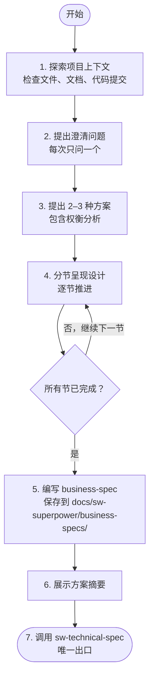

# 头脑风暴与需求分析

通过与用户的苏格拉底式对话，将模糊的想法转化为清晰的需求和明确的设计决策。

## 何时跳过此流程

**以下情况属于简单任务，不经过头脑风暴，直接调用 `sw-test-driven-dev`：**

- 改动范围明显很小（Agent 通过快速代码扫描即可确认，如单函数修改、参数调整、局部逻辑修复）
- 纯 Bug 修复（问题明确、修复方案清晰、且**不涉及**新增组件/接口变更/多模块影响）
- 配置、文档或注释的修改
- 用户明确说"直接改"或"别走流程"
- 拼写、格式、命名等表面层的修复
- 已有明确 technical-spec 或 working-plan 的任务执行

**不确定是否属于简单任务？** 走头脑风暴流程。宁可流程过度，不可跳过设计。

**以下情况必须走头脑风暴，不可走快速通道：**

| 场景 | 说明 |
|------|------|
| Bug 修复涉及新增组件 | 需要新增文件、模块或服务 |
| Bug 修复涉及接口变更 | 修改函数签名、API 契约或数据结构 |
| Bug 影响多个模块 | 修复一处导致其他模块需要适配 |
| 快速扫描后发现改动范围超预期 | 原本以为只改单函数，实际涉及多处修改 |

**回退规则**：快速扫描后发现改动超出预期 → 立即回退到头脑风暴流程。

## 核心原则

**铁律：在完整呈现设计方案之前，严禁执行以下任何操作：**
- 调用任何实现类技能（如 sw-subagent-development）
- 编写任何代码
- 创建项目脚手架
- 执行任何实现层面的动作

> 设计必须完整呈现（需求澄清 + 方案决策 + business-spec），但无需在每个节点等待用户明确批准。Agent 自动推进流程，用户可随时打断并提出异议。

> **反模式警告**："这个需求太简单了，不需要设计"
>
> 复杂项目必须经过此流程。所谓"简单"的项目，往往是未经验证的假设造成最大浪费的地方。如果改动确实明显简单（见上方"何时跳过此流程"），直接走测试驱动开发。

## 任务清单

必须按顺序完成以下任务：

- [ ] **探索项目上下文** — 检查文件结构、项目文档、最近的代码提交
- [ ] **提出澄清问题** — 每次只问一个问题，聚焦目的、约束与成功标准
- [ ] **提出 2–3 种方案** — 包含各方案的权衡分析与你的推荐
- [ ] **分节呈现设计** — 根据复杂度调整每节长度，自动推进到下一节
- [ ] **编写 business-spec** — 保存到 `docs/sw-superpower/business-specs/YYYY-MM-DD--<name>.md`
- [ ] **展示方案摘要** — 向用户呈现关键决策要点，随后自动进入下一步
- [ ] **自动调用 sw-technical-spec** — 编写 technical-spec

## 流程图



## 详细流程

### 1. 探索项目上下文

在向用户提问之前，先了解以下信息：
- 当前项目结构（`ls -la`, `tree`）
- 相关文档（README、AGENTS.md、现有 spec 文档）
- 最近的 Git 提交历史
- 与需求相关的现有代码

**范围评估**：如果用户请求涉及多个独立子系统（例如"构建一个包含聊天、文件存储、计费和分析的平台"），立即标记出来。不要在一个明显需要拆分的项目上浪费时间细化需求。

如果项目规模过大：
1. 帮助用户将大项目分解为若干子项目
2. 确定各组件的独立性和依赖关系，明确构建顺序
3. 对第一个子项目执行正常的头脑风暴流程
4. 每个子项目拥有独立的 business-spec → technical-spec → working-plan → 实现周期

### 2. 提出澄清问题

**规则**：
- 每次只能问一个问题
- 尽可能使用选择题，开放式问题也可接受
- 需要深入探索时，将大主题分解为多个小问题
- 聚焦：目的、约束条件、成功标准

**对话示例**：
```
你：这个功能的用户是谁？
用户：主要是我们的内部运营团队。

你：明白了。关于数据存储，你有什么偏好吗？
A) 继续使用现有的 PostgreSQL
B) 尝试新的 MongoDB
C) 使用外部服务（如 Firebase）

用户：选 A，保持 PostgreSQL。
```

### 3. 提出 2–3 种方案

探索方案时：
- 提出 2–3 种不同方法，并分析各自的权衡
- 以对话方式呈现各选项，附带你的推荐及理由
- 先呈现你的推荐方案并解释原因

### 4. 分节呈现设计

**一旦理解了要构建的内容，按节呈现设计方案：**

- 每节长度根据复杂度调整：简单需求几句话带过，复杂需求 200–300 字
- 每节结束后展示本节要点，**自动进入下一节**，不等待用户回复
- 内容涵盖：目标、约束条件、关键组件、接口草案、验收标准初稿
- 如果某部分设计不合理，随时准备回退并重新澄清

> **自动推进说明**：Agent 展示每节设计后自动推进到下一节。如果用户对设计方向有根本性异议，可随时打断。

**回退路径**：如果用户对设计方向有**根本性异议**（例如"完全不是我要的"、"方向错了"、"重新想"），不要在本节内反复修改。立即回退到：
- 需求理解出现偏差 → 回到第 2 步（澄清问题），重新确认目标
- 方案方向完全错误 → 回到第 3 步（提出方案），重新探索替代方案

所有节展示完成后，自动进入"编写 business-spec"阶段。

**设计原则**：
- 将系统分解为更小的单元，每个单元有明确目的，通过定义良好的接口通信，可被独立理解和测试
- 对每个单元，能够回答：它做什么？如何使用？依赖什么？
- 能否在不阅读内部实现的情况下理解单元功能？能否在不破坏使用者的情况下修改内部？如果不能，说明边界需要调整

**在现有代码库中工作**：
- 提出更改前先探索当前结构，遵循现有模式
- 当现有代码存在影响工作的问题时（如文件过大、边界不清、职责纠缠），将针对性改进纳入设计——就像优秀开发者改进正在处理的代码一样
- 不要提出与当前目标无关的重构，专注于服务当前目标的内容

### 5. 编写 business-spec 文档

**文档规范**：
- 将需求澄清结果保存到 `docs/sw-superpower/business-specs/YYYY-MM-DD--<feature-name>.md`
- 内容轻量，聚焦业务层面：目标、非目标、方案决策、关键组件草案、验收标准初稿
- 不展开详细的技术架构、数据流设计、错误处理方案（留给 `sw-technical-spec`）
- 编写完成后提交到 Git

**business-spec 结构**：

```markdown
# {{功能名称}} - 业务需求

## 概述
一句话描述这个功能是什么，解决什么问题。

## 背景与动机
为什么要做这个功能？用户的痛点是什么？

## 用户与角色
- **主要用户**: {{使用者是谁}}
- **使用场景**: {{典型使用场景}}

## 关键约束
- {{技术约束，如必须使用现有技术栈}}
- {{时间或预算约束}}
- {{合规或安全要求}}

## 目标
- {{目标 1}}
- {{目标 2}}

## 非目标
明确排除的范围，避免范围蔓延。
- {{非目标 1}}
- {{非目标 2}}

## 方案决策
**选定方案**: {{方案名称}}
**原因**: {{选择此方案的理由}}
**替代方案**: {{考虑过的其他方案及放弃原因}}

## 关键组件（草案）
- {{组件 1}}: {{职责简述}}
- {{组件 2}}: {{职责简述}}

## 验收标准（初稿）
- [ ] {{验收标准 1}}
- [ ] {{验收标准 2}}

## 风险与缓解

| 风险 | 影响 | 缓解措施 |
|------|------|---------|
| {{风险 1}} | {{高/中/低}} | {{缓解措施}} |
```

### 6. 展示方案摘要

文档编写完成后，向用户展示方案摘要，然后**自动调用 `sw-technical-spec`**：

> "需求已澄清并保存到 `docs/sw-superpower/business-specs/YYYY-MM-DD--<name>.md`。以下是方案摘要：
> - [目标概述]
> - [选定方案及原因]
> - [关键组件草案]
> - [验收标准数量]
>
> 现在自动进入 technical-spec 编写阶段。"

**自动推进**：展示摘要后立即调用 `sw-technical-spec`，无需等待用户回复。用户如有修改需求可随时打断。

### 7. 进入 technical-spec 阶段

**唯一出口**：调用 `sw-technical-spec` 技能编写完整 technical-spec。

**严禁**：
- 调用 sw-working-plan
- 调用 sw-subagent-development
- 调用 sw-test-driven-dev
- 直接开始编码

## 关键原则

| 原则 | 说明 |
|------|------|
| **一次一个问题** | 不要用多个问题同时询问用户 |
| **优先选择题** | 比开放式问题更容易回答，减少用户思考负担 |
| **YAGNI 无情** | 从所有设计中删除当前不必要的功能 |
| **探索替代方案** | 在确定方案前，总是提出 2–3 种方法供对比 |
| **增量验证** | 分节呈现设计，每节展示后自动推进 |
| **保持灵活** | 某部分不合理时，随时回退并重新澄清 |

## 红旗 —— 立即停止

| 危险想法 | 真相 |
|------|------|
| "用户大概会同意，我先开始实现" | 未经完整设计流程，严禁开始实现。设计可以很短，但必须完整呈现 |
| "跳过需求澄清直接写 technical-spec" | 需求不清 → technical-spec 方向错误。必须先澄清需求 |
| "不需要替代方案，我知道最佳方案" | 未呈现替代方案就确定设计 = 未经验证的假设。总是提出 2–3 种方法 |
| "把多个问题合并问更快" | 一次一个问题。合并会压倒用户，降低回答质量 |
| "编写 business-spec 后立即开始编码" | 必须先由 sw-technical-spec 编写完整 technical-spec。编码是更后方的步骤 |
| "简单任务不需要头脑风暴" | 正确。简单任务走快速通道直接 TDD。不确定是否简单？走头脑风暴 |

## 常见借口与真相

| 借口 | 真相 |
|------|------|
| "这个太简单了，不需要设计" | 单文件少于 50 行的改动走快速通道。超出范围的"简单"必须设计 |
| "用户不需要看设计过程" | 完整呈现设计是纪律。跳过 = 遗漏关键决策 |
| "先写代码再补设计" | 设计先行是纪律。代码先行 = 即兴开发 |
| "问题太多用户会烦" | 每次一个问题比合并问题更快获得清晰答案 |
| "简单任务不需要头脑风暴" | 正确。简单任务走快速通道直接 TDD |

## YAGNI 原则

**You Aren't Gonna Need It（你不需要它）**

对每个设计决策问：
- 这个功能现在需要吗？
- 可以稍后添加而不破坏现有代码吗？
- 这是假设的需求还是已确认的需求？

如果答案是不确定，删除它。

## 输出示例

**business-spec 文件路径**: `docs/sw-superpower/business-specs/2026-04-08--user-authentication.md`

**返回摘要格式**：
```markdown
## 头脑风暴完成

**business-spec 文件**: `docs/sw-superpower/business-specs/2026-04-08--user-authentication.md`
**设计状态**: ✅ 已完成
**主要决策**:
- 目标：为内部运营团队提供统一身份认证
- 方案：JWT + bcrypt，支持邮箱和 OAuth
- 关键组件：AuthService、UserStore、TokenManager

**下一步**: 调用 sw-technical-spec 编写 technical-spec
```

## 与其他技能的集成

**前置 Skill**: 无（这是工作流起点）

**后续 Skill**: 
- **sw-technical-spec** - 必须调用的下一个技能
- 严禁直接调用实现类技能

**相关 Skill**: 无
