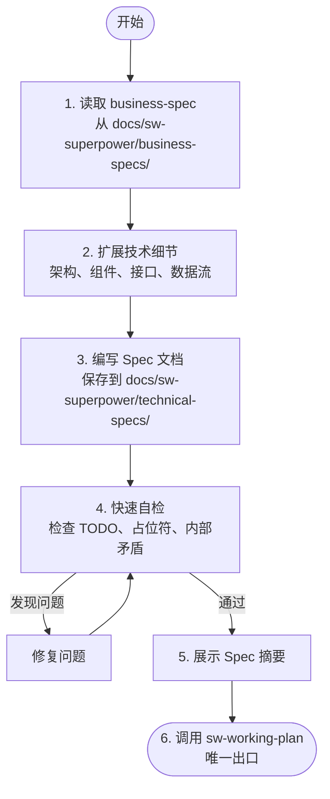

# Technical Spec - 编写技术规格文档

将业务需求澄清后的设计决策转化为结构化的技术 Spec 文档。

## 何时使用

- 需求已通过 `sw-brainstorming` 澄清并确定方案后
- 需要编写可供工程师直接参考的技术文档时
- 需要明确接口定义、数据流、错误处理策略时

## 何时跳过

- 用户明确说"直接改"或"别走流程"
- 已有完整的技术 Spec 文档
- 纯配置/文档/注释修改

## 核心原则

**铁律：在 Spec 完成之前，严禁：**
- 调用任何实现 Skill（如 sw-subagent-development）
- 编写任何代码
- 创建项目脚手架
- 执行任何实现动作

## 检查清单

必须按顺序完成以下任务：

- [ ] **读取 business-spec** — 从 `docs/sw-superpower/business-specs/` 读取需求澄清结果
- [ ] **扩展技术细节** — 基于业务决策补充架构、组件、接口、数据流、错误处理
- [ ] **编写 Spec 文档** — 保存到 `docs/sw-superpower/technical-specs/YYYY-MM-DD--<name>.md`
- [ ] **Spec 快速自检** — 检查 TODO、占位符、内部矛盾
- [ ] **展示 Spec 摘要** — 向用户展示 Spec 要点，自动进入下一步
- [ ] **自动调用 sw-working-plan** — 创建实现计划

## 流程图



## 详细流程

### 0. 入口门控

在开始前检查：
1. **business-spec 存在性**：`docs/sw-superpower/business-specs/YYYY-MM-DD--<feature>.md` 是否存在？
2. **需求已澄清**：该文档是否已通过 `sw-brainstorming` 完成需求澄清？

如果任一检查失败：
- **business-spec 不存在** → 告知用户："未找到业务需求文档。请先执行 sw-brainstorming 完成需求澄清阶段。"
- **需求未澄清** → 告知用户："需求尚未澄清。请返回 sw-brainstorming 完成需求分析流程。"
- **两者都通过** → 继续执行第 1 步

### 1. 读取 business-spec

读取 `docs/sw-superpower/business-specs/YYYY-MM-DD--<feature>.md`，理解：
- 业务目标和背景
- 选定的方案及原因
- 关键组件和接口草案
- 验收标准初稿
- 明确的排除范围（非目标）

### 2. 扩展技术细节

基于 business-spec 中的决策，扩展以下内容：

**架构概述**
- 高层架构图或描述
- 组件间的通信方式

**组件设计（详细）**
- 每个组件的完整接口定义
- 输入/输出、错误类型
- 依赖关系

**数据流**
- 数据如何在组件间流动
- 状态管理策略

**错误处理**
- 错误分类和处理策略
- 重试机制、降级方案

**安全考虑**
- 身份验证、授权
- 数据加密、输入校验

### 3. 编写 Spec 文档

**文档规范**：
- 将完整技术设计保存到 `docs/sw-superpower/technical-specs/YYYY-MM-DD--<feature-name>.md`
- 遵循 Spec 文档结构（见 subagent-prompts/spec-writer-prompt.md）
- 提交到 Git

### 4. Spec 快速自检

Agent 自行快速扫描 Spec，**不调用子 Agent**，仅检查以下三类致命问题：

- **TODO / TBD / 占位符**：任何标记为待办、未决定、后续补充的内容
- **内部矛盾**：需求之间相互冲突、同一概念前后定义不一致
- **不完整部分**：明显缺失的章节、空白接口定义、缺失的验收标准

**执行方式**：
1. 逐节浏览 Spec，标记上述三类问题
2. 发现问题 → 当场修复 → 重新扫描确认
3. **最多迭代 1 轮**，修复后不再重复全文审查
4. 无致命问题 → 立即进入下一步

**明确不检查的内容**（留给 `sw-working-plan` 阶段）：
- 措辞风格、文档格式
- YAGNI 审查（实现计划阶段再判断）
- 清晰性打磨（不影响构建的模糊表述）

### 5. 展示 Spec 摘要

快速自检通过后，向用户展示 Spec 摘要，然后**自动调用 `sw-working-plan`**：

> "技术 Spec 已编写并提交到 `docs/sw-superpower/technical-specs/YYYY-MM-DD--<name>.md`。以下是 Spec 要点摘要：
> - [设计概述一句话]
> - [关键组件]
> - [主要接口]
> - [验收标准数量]
>
> 现在自动进入实现计划阶段。"

**自动推进**：展示摘要后立即调用 `sw-working-plan`，无需等待用户回复。用户如有修改需求可随时打断。

### 6. 进入实现规划

**唯一出口**：调用 `sw-working-plan` Skill 创建详细实现计划。

**严禁**：
- 调用 sw-subagent-development
- 调用 sw-test-driven-dev
- 直接开始编码

## 关键原则

| 原则 | 说明 |
|------|------|
| **基于业务决策** | 不偏离 business-spec 中已确认的方案和范围 |
| **具体明确** | 每个接口、数据结构、错误类型都必须明确定义 |
| **不新增需求** | 不在 technical-spec 中引入 brainstorming 未讨论的功能 |
| **快速自检** | 只查致命问题，不追求完美文档 |

## 红旗 - 立即停止

| 想法 | 现实 |
|------|------|
| "business-spec 不清楚，我先按理解写" | business-spec 不清楚 → 回到 sw-brainstorming 重新澄清 |
| "跳过 Spec 快速自检" | 快速自检捕获 TODO、占位符、内部矛盾。跳过 = 有缺陷的 Spec 进入实现阶段 |
| "在 Spec 里补充业务背景" | business-spec 已经包含背景，technical-spec 聚焦技术实现 |
| "编写 Spec 后立即开始编码" | 必须通过快速自检。编码是唯一出口后的步骤 |

## 常见借口表

| 借口 | 现实 |
|------|------|
| "business-spec 太简单，不需要扩展" | 即使需求简单，接口定义和验收标准仍需明确 |
| "Spec 自检浪费时间" | 快速自检只需 30 秒，发现 TODO/占位符/矛盾可避免实现阶段卡住 |
| "先写代码再补 Spec" | 设计先行是纪律。代码先行 = 即兴开发 |

## YAGNI 原则

**You Aren't Gonna Need It**

对每个技术决策问：
- 这个功能现在需要吗？
- 可以稍后添加而不破坏现有代码吗？
- 这是假设的需求还是已确认的需求？

如果答案是不确定，删除它。

## 输出示例

**Spec 文件路径**: `docs/sw-superpower/technical-specs/2026-04-08--user-authentication.md`

**返回摘要格式**：
```markdown
## 技术 Spec 完成

**Spec 文件**: `docs/sw-superpower/technical-specs/2026-04-08--user-authentication.md`
**设计状态**: ✅ 已完成
**主要决策**:
- 使用 JWT 进行身份验证
- 密码使用 bcrypt 哈希
- 支持邮箱+密码和 OAuth 两种方式

**下一步**: 调用 sw-working-plan 创建实现计划
```

## 集成

**前置 Skill**: sw-brainstorming（提供业务需求文档）

**后续 Skill**: 
- **sw-working-plan** - 必须调用的下一个 Skill
- 严禁直接调用实现类 Skill

**相关 Skill**: 无
