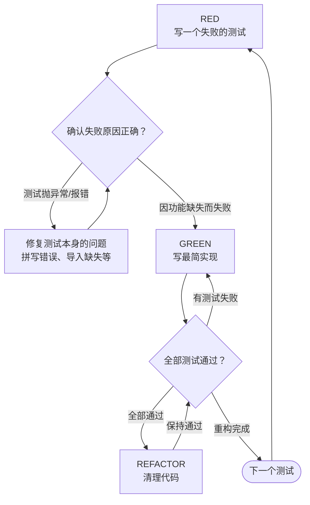

# 测试驱动开发（TDD）

## 铁律

```
没有先失败的测试，就不写生产代码
NO PRODUCTION CODE WITHOUT A FAILING TEST FIRST
```

已经先写了实现代码？**删掉它，从头开始。**

**没有任何例外：**
- 不要保留"作为参考"
- 不要"适配"到测试里
- 不要去看它
- 删就是删

> **违反规则的字面意思，就是违反规则的精神。**

## 何时使用

**以下情况必须使用 TDD：**
- 新功能开发
- Bug 修复
- 代码重构
- 行为变更

**以下情况需询问用户是否跳过：**
- 一次性原型（Spike）
- 生成的代码（脚手架、代码生成器输出）
- 纯配置文件

**如果你在想"这次先跳过 TDD"——立刻停止。这是自我合理化。**

## RED-GREEN-REFACTOR 循环



## 详细流程

### RED —— 写一个失败的测试

写一个最小的测试，明确展示你期望发生什么。

**好测试示例：**
```python
def test_retries_failed_operations_3_times():
    """失败的操作应该被重试 3 次"""
    attempts = 0
    def operation():
        nonlocal attempts
        attempts += 1
        if attempts < 3:
            raise Error('fail')
        return 'success'
    
    result = retry_operation(operation)
    
    assert result == 'success'
    assert attempts == 3
```
✅ 名称清晰、测试真实行为、只做一件事

**坏测试示例：**
```python
def test_retry_works():
    mock = Mock()
    mock.side_effect = [Error(), Error(), 'success']
    retry_operation(mock)
    assert mock.call_count == 3
```
❌ 名称模糊、测试的是 Mock 而非真实代码

**写好测试的要求：**
- 只测一个行为
- 名称清晰（描述行为，而非方法名）
- 用真实代码（除非绝对不可避免，否则不要用 Mock）

### 验证 RED —— 看着它失败

**强制步骤。严禁跳过。**

```bash
# Python
python -m pytest path/to/test.py -v

# JavaScript
npm test path/to/test.test.js
```

确认以下几点：
- 测试确实失败了（不是报错抛异常）
- 失败信息符合预期
- 失败原因是功能尚未实现（不是拼写错误或导入问题）

**测试直接通过了？** 说明你在测已有行为。修改测试，让它测新行为。

**测试报错抛异常？** 修复测试本身的错误，重新运行，直到它因正确的理由失败。

### GREEN —— 写最简实现

写最简单的代码让测试通过。

**好的最简实现：**
```python
def retry_operation(fn):
    for i in range(3):
        try:
            return fn()
        except Exception as e:
            if i == 2:
                raise e
    raise Error('unreachable')
```
刚好足够通过测试，不多不少。

**过度设计的反面教材：**
```python
def retry_operation(
    fn,
    max_retries=3,
    backoff='linear',
    on_retry=None
):
    # YAGNI —— 你目前不需要这些
    pass
```
不要添加功能、不要重构其他代码、不要"改进"到超出当前测试的范围。

### 验证 GREEN —— 看着它通过

**强制步骤。**

```bash
python -m pytest path/to/test.py -v
```

确认：
- 新测试通过
- 其他已有测试仍然通过
- 输出干净（无错误、无警告）

**新测试失败？** 修复实现代码，不是修改测试。

**其他已有测试失败？** 立即修复，不能留到后面。

### REFACTOR —— 清理代码

只在测试变绿之后：
- 消除重复代码
- 改进命名
- 提取辅助函数

保持所有测试通过。不要添加新行为。

### 重复

为下一个功能写下一个失败测试，循环往复。

## 好测试的特征

| 特征 | 好的做法 | 坏的做法 |
|------|---------|---------|
| **最小化** | 只测一件事。如果测试名里有"和"，拆开。 | `test_validates_email_and_domain_and_whitespace()` |
| **清晰** | 名称描述行为 | `test1()` |
| **展示意图** | 展示期望的 API 用法 | 隐藏代码应该做什么 |

## 为什么顺序至关重要

### "我先写代码，之后再补测试来验证"

之后写的测试一跑就通过。立即通过的测试证明不了任何东西：
- 你可能测错了东西
- 你可能测的是实现细节而非行为
- 你可能漏掉了你忘记的边界情况
- 你从未亲眼见过这个测试能抓住 Bug

先写测试迫使你看到它失败，证明它确实在测某些东西。

### "我已经手动测试过所有边界情况了"

手动测试是不可靠的。你以为你都测了，但：
- 没有测试记录，无法追溯
- 代码变更时不能自动重新运行
- 时间压力下容易遗漏情况
- "我试的时候是好用的" ≠ 全面覆盖

自动化测试是系统性的。每次运行都一样。

### "删掉 X 小时的工作太浪费了"

这是沉没成本谬误。时间已经花掉了。现在的选择：
- 删掉，用 TDD 重写（再花 X 小时，但信心十足）
- 保留，之后补测试（30 分钟，但信心不足，可能藏 Bug）

真正的"浪费"是你无法信任的代码。没有真实测试覆盖的代码是技术债务。

### "TDD 是教条主义，实用主义应该灵活适应"

TDD **本身就是**实用的：
- 提交前发现 Bug（比上线后调试快得多）
- 防止回归（测试立即捕获破坏）
- 文档化行为（测试展示如何使用代码）
- 启用安全重构（自由修改，测试捕获破坏）

所谓"实用"的捷径 = 生产环境调试 = 实际上更慢。

## 常见借口与真相

| 借口 | 真相 |
|------|------|
| "太简单了，不需要测试" | 简单代码也会坏。写个测试只需 30 秒。 |
| "我会之后补测试" | 之后写的测试立即通过，证明不了什么。 |
| "之后测和先测效果一样" | 之后 = "这代码做了什么？" 先 = "这代码应该做什么？" |
| "我已经手动测过了" | 临时测试 ≠ 系统性测试。无记录，无法重复运行。 |
| "删掉 X 小时是浪费" | 沉没成本谬误。保留未验证的代码才是技术债务。 |
| "保留作为参考，我先写测试" | 你会忍不住适配它。这就是"之后测试"。删意味着删。 |
| "我需要先探索一下" | 可以。但探索完要丢弃，用 TDD 重新开始。 |
| "这代码太难测了" | 听测试的。难测 = 难用 = 设计有问题。 |
| "TDD 会拖慢我" | TDD 比调试快。实用 = 先测试。 |
| "手动测试更快" | 手动测证明不了边界情况。每次修改都要重新手动测。 |
| "现有代码本来就没测试" | 你正在改进它。给现有代码补测试。 |

## 红旗 - 立刻停止并重新开始

| 想法 | 现实 |
|------|------|
| "先写点代码再补测试" | 立刻停止，删掉代码，用 TDD 重新开始 |
| "实现完了再补测试" | 之后立即通过的测试证明不了什么 |
| "测试怎么直接通过了" | 你在测已有行为，不是新行为 |
| "我说不清为什么这个测试会失败" | 测试必须有明确意图。说不清 = 测试有问题 |
| "稍后我再补测试" | 稍后 = 永远不会。先测试。 |
| "就这一次跳过" | "就这一次"合理化 = 每次都会跳过 |
| "我已经手动测过了" | 临时 ≠ 系统性。无记录，不能重复运行。 |
| "之后测效果一样" | 之后 = "这做了什么？" 先 = "这应该做什么？" |
| "这是精神不是仪式" | 违反规则的字面意思就是违反精神 |
| "保留作为参考"或"适配现有代码" | 你会适配它。删意味着删。 |
| "已经花了 X 小时，删了浪费" | 沉没成本谬误。保留未验证代码是技术债务。 |
| "TDD 教条，我实用" | TDD 比调试快。实用 = 先测试。 |
| "这次情况特殊因为…" | 没有例外。删掉代码。用 TDD 重新开始。 |

**以上所有情况都意味着：删掉代码。用 TDD 重新开始。**

## 示例：修复 Bug

**Bug 描述**：空邮箱被错误地接受

### RED
```python
def test_rejects_empty_email():
    result = submit_form({'email': ''})
    assert result.error == '邮箱不能为空'
```

### 验证 RED
```bash
$ python -m pytest
FAIL: expected '邮箱不能为空', got undefined
```

### GREEN
```python
def submit_form(data):
    if not data.get('email', '').strip():
        return {'error': '邮箱不能为空'}
    # ...
```

### 验证 GREEN
```bash
$ python -m pytest
PASS
```

### REFACTOR
为多字段提取通用验证逻辑（如需要）。

## 验证清单

### 单个测试循环验证（每个测试完成后检查）

标记工作完成前，确认：

- [ ] 每个新函数/方法都有对应的测试
- [ ] 实现之前，亲眼看过每个测试失败
- [ ] 每个测试因预期原因失败（功能缺失，不是拼写错误）
- [ ] 编写了最简代码让每个测试通过
- [ ] 所有测试全部通过
- [ ] 测试输出干净（无错误、无警告）
- [ ] 测试使用真实代码（除非绝对不可避免，否则避免 Mock）
- [ ] 边界情况和错误路径已被覆盖

不能全部勾选？说明你跳过了 TDD。从头开始。

### 功能完成验证（整个功能完成后检查）

**什么时候停止写新测试？** 确认以下所有项：

**测试覆盖：**
- [ ] 所有计划中的行为都有对应的测试（对照 Spec 逐条核对）
- [ ] 每个新函数/方法都有测试
- [ ] 边界情况被覆盖（空值、极限值、异常输入）
- [ ] 错误路径被覆盖（失败场景、异常处理）
- [ ] 无遗漏的隐性需求（对照 Spec 逐条核对）

**代码质量：**
- [ ] 无重复代码（DRY）
- [ ] 命名清晰（函数/变量名描述意图，不依赖注释解释）
- [ ] 无过度设计（没有超出当前测试范围的功能）

**验证状态：**
- [ ] 所有测试通过
- [ ] 测试输出干净（无错误、无警告、无跳过）

**判断：**
- ✅ 全部通过 → 功能完成，停止 TDD 循环
- ❌ 任一项未通过 → 继续循环（写新测试覆盖遗漏，或重构修复质量问题）

> **红旗**："我觉得差不多了" = 你没有对照 Spec 逐条核对。用检查清单，不要凭感觉。

## 卡住时怎么办

| 问题 | 解决方案 |
|------|---------|
| 不知道怎么写测试 | 先写期望的 API。先写断言。询问用户。 |
| 测试写起来太复杂 | 设计太复杂了。简化接口。 |
| 必须 Mock 所有东西 | 代码耦合太紧。使用依赖注入。 |
| 测试的 setup 代码太庞大 | 提取辅助函数。还复杂？简化设计。 |

## 与调试的集成

发现 Bug？先写一个能重现它的失败测试。然后遵循 TDD 循环。测试既证明修复有效，又防止未来回归。

**绝不修复没有测试覆盖的 Bug。**

## 最终规则

```
生产代码 → 必须有先失败的测试
否则 → 这不是 TDD
```

没有用户明确许可的例外。

## 与其他技能的集成

**前置 Skill**: sw-working-plan（提供实现计划）

**后续 Skill**: sw-subagent-development

**此 Skill 被调用时**:
- 开始实现任何任务时
- 修复任何 Bug 时
- 重构任何代码时

**子 Agent 必须遵循**:
- 实现子 Agent 在执行每个任务时必须遵循此 Skill
- 代码审查子 Agent 必须验证 TDD 是否被严格遵循
