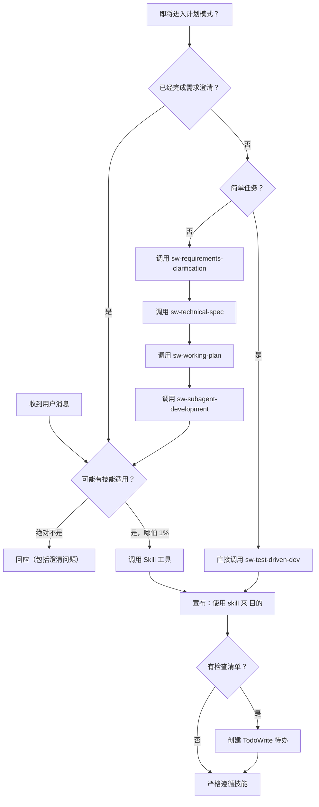

<SUBAGENT-STOP>
如果你作为子 Agent 被分派执行特定任务，跳过此技能。
</SUBAGENT-STOP>

<EXTREMELY-IMPORTANT>
如果你认为有哪怕 1% 的概率某个技能可能适用于你正在做的事，你**绝对必须**调用该技能。

如果某个技能适用于你的任务，你别无选择。**你必须使用它。**

这不是可协商的。这不是可选的。你无法合理化地逃避它。
</EXTREMELY-IMPORTANT>

## 指令优先级

Agile Development 技能覆盖默认系统提示行为，但**用户指令始终优先**：

1. **用户的明确指令**（CLAUDE.md、GEMINI.md、AGENTS.md、直接请求）—— 最高优先级
2. **Agile Development 技能** —— 在与默认系统行为冲突时覆盖
3. **默认系统提示** —— 最低优先级

如果 AGENTS.md 说"不要用 TDD"而某个技能说"始终用 TDD"，遵循用户的指令。用户拥有控制权。

## 如何访问技能

**在 Claude Code 中：** 使用 `Skill` 工具。调用技能时，其内容会被加载并直接呈现给你——直接遵循它。绝不要用 Read 工具读取技能文件。

**在 Copilot CLI 中：** 使用 `skill` 工具。技能从安装的插件中自动发现。`skill` 工具与 Claude Code 的 `Skill` 工具工作方式相同。

**在 Gemini CLI 中：** 技能通过 `activate_skill` 工具激活。Gemini 在会话开始时加载技能元数据，并在需要时激活完整内容。

**在其他环境中：** 查看你平台的文档以了解如何加载技能。

## 平台适配

技能使用 Claude Code 工具名称。非 CC 平台：参见 `references/copilot-tools.md`（Copilot CLI）、`references/codex-tools.md`（Codex）以了解工具等效项。Gemini CLI 用户通过 GEMINI.md 自动获得工具映射。

**OpenCode 用户：** 当技能引用你没有的工具时，替换为 OpenCode 等效项：

| Claude Code 工具 | OpenCode 等效项 |
|-----------------|----------------|
| `TodoWrite` | `todowrite` |
| `Task` 工具配子 Agent | 使用 OpenCode 的子 Agent 系统 |
| `Skill` 工具 | OpenCode 原生 `skill` 工具 |
| `Read` | `read` |
| `Write` | `write` |
| `Edit` | `edit` |
| `Bash` | `bash` |
| `Grep` | `grep` |
| `Glob` | `glob` |
| `WebFetch` | `webfetch` |
| `WebSearch` | （如需要，使用 `webfetch` 访问搜索引擎） |

# 使用技能

## 规则

**在做出任何回应或行动之前调用相关或被请求的技能。** 即使只有 1% 的概率某个技能可能适用，你也应该调用该技能来检查。如果被调用的技能结果不适用于当前情况，你不需要使用它。

### 简单任务快速通道

**只有满足以下条件的任务，才能跳过 requirements-clarification 和 writing-specs，直接调用 `sw-test-driven-dev`：**

- 纯配置/环境变更（如 `.env`、CI 配置、依赖版本号）
- 纯文档/注释更新（README、API 文档、代码注释）
- 拼写、格式、命名等表面层修复
- 单一文件内的单函数逻辑修复，且**用户已提供具体修复方案**
- 用户明确说"直接改"或"别走流程"

**以下情况一律不走快速通道，必须走完整流程：**
- 新增功能、组件、接口、模块
- 涉及多文件修改或跨模块影响
- Bug 根因不明确，需要调试/排查才能定位
- 涉及数据库 schema、API 契约、配置结构变更
- 删除或重构现有代码
- 任何需要 Agent 自行判断"范围大小"的任务

**不满足快速通道条件？** 走完整流程：sw-requirements-clarification → sw-technical-spec → sw-working-plan → sw-subagent-development。

## 红旗 - 停止并检查技能

这些想法意味着停止——你在合理化：

| 想法 | 现实 |
|------|------|
| "这只是个简单问题" | 简单任务用快速通道（直接 TDD），不是跳过技能。 |
| "我需要更多上下文先" | 技能检查先于澄清问题。 |
| "让我先探索代码库" | 技能告诉你 HOW 探索。先检查。 |
| "我可以快速检查 git/文件" | 文件缺乏会话上下文。检查技能。 |
| "让我先收集信息" | 技能告诉你 HOW 收集信息。 |
| "这不需要正式技能" | 如果技能存在，使用它。 |
| "我记得这个技能" | 技能会演进。读取当前版本。 |
| "这不算是任务" | 行动 = 任务。检查技能。 |
| "这技能大材小用" | 简单任务用快速通道，复杂任务走完整流程。 |
| "我先做这一件事" | 在做任何事之前先检查。 |
| "这感觉很 productive" | 无纪律的行动浪费时间。技能防止这个。 |
| "我知道那是什么意思" | 知道概念 ≠ 使用技能。调用它。 |
| "简单任务不需要 requirements-clarification" | 正确。简单任务走快速通道，直接 TDD。但复杂任务必须 requirements-clarification。 |

## 常见借口表

| 借口 | 现实 |
|------|------|
| "这个任务太简单，不需要技能" | 简单任务走快速通道（TDD），仍然需要技能 |
| "我已经知道怎么处理" | 技能会演进。读取当前版本，不凭记忆 |
| "先做完这一件事再检查技能" | 在做任何事之前先检查。事后检查 = 已犯错 |
| "技能检查浪费时间" | 10 秒检查可能节省数小时返工 |
| "这个场景太特殊，没有对应技能" | 即使 1% 概率适用也要检查。你可能错了 |
| "简单任务不需要走完整流程" | 正确。快速通道允许跳过 requirements-clarification，但仍需 TDD |

## 技能优先级

当多个技能可能适用时，使用此顺序：

1. **流程技能优先**（requirements-clarification、debugging）—— 这些决定 HOW 接近任务
2. **实现技能其次**（frontend-design、mcp-builder）—— 这些指导执行

"让我们构建 X" → requirements-clarification 优先，然后实现技能。
"修复这个 Bug" → debugging 优先，然后领域特定技能。

## 技能类型

**刚性**（TDD、debugging）：精确遵循。不要淡化纪律。

**灵活**（patterns）：根据上下文调整原则。

技能本身会告诉你属于哪种。

## 术语规范

本框架使用特定的中英文术语约定，所有 SKILL.md 文件和对用户输出必须遵循 `docs/terminology.md` 中的规范。关键术语摘要：

| 中文 | 英文（保留） | 说明 |
|------|-------------|------|
| 技能 | **Skill** | 框架核心概念，但 sw-using-agiledevelopment 等少数引导文件中保留英文 |
| 智能体 | **Agent** | AI 编程助手 |
| 子智能体 | **Subagent** | 被分派执行任务的 Agent 实例 |
| 业务规范 | **business-spec** | `docs/sw-agiledevelopment/business-specs/` 中的文档 |
| 技术规范 | **technical-spec** | `docs/sw-agiledevelopment/technical-specs/` 中的文档 |
| 实施计划 | **working-plan** | `docs/sw-agiledevelopment/plans/` 中的文档 |
| 规范（泛指） | **spec** | 泛指 business-spec 或 technical-spec |
| 待办事项 | **TODO** | 也可写 TODO |
| 令牌 | **token** | 上下文令牌 |

**规则**：首次出现时标注 `英文（中文）`，后续直接使用英文。严禁同一文档内混用。

## 用户指令

指令说的是 WHAT，不是 HOW。"添加 X" 或 "修复 Y" 并不意味着跳过工作流。
